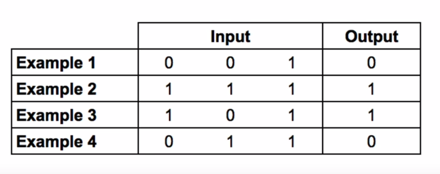
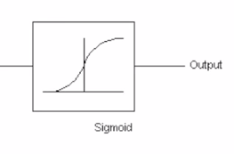

# Simple Neural Network

## Description

A simple, one layer neural network built in python for learning purpose.


## How does it works?

### 1. Training data

Assuming the following training data.



We give it as follow to our neural network
``` python
training_set_inputs = array([
  [0, 0, 1], # example 1 input
  [1, 1, 1], # example 2 input
  [1, 0, 1], # example 3 input
  [0, 1, 1]] # example 4 input
)
# output 1, 2, 3 and 4:
training_set_outputs = array([[0, 1, 1, 0]]).T
```

### 2. Neural Network

The neural network will be initialiazed with random weights (w1, w2, w3) for each input (x1, x2, x3).


In order to predict the result we calculate the dot product of our inputs and weights. We "activate" this using a sigmoid function :



``` python
def __sigmoid(self, x):
    return 1 / (1 + exp(-x))

def predict(self, inputs):
    # prediction is the dot product of our inputs and our weights
    return self.__sigmoid(dot(inputs, self.synaptic_weights))

```

The sigmoid function allows us to:
- get an output between 0 and 1
- find the adjustment which minimize the error using gradient descent method


After that we use backpropagation. In other words, we calculate new weights and we repeat the process following the "iteration number" given in parameter.
